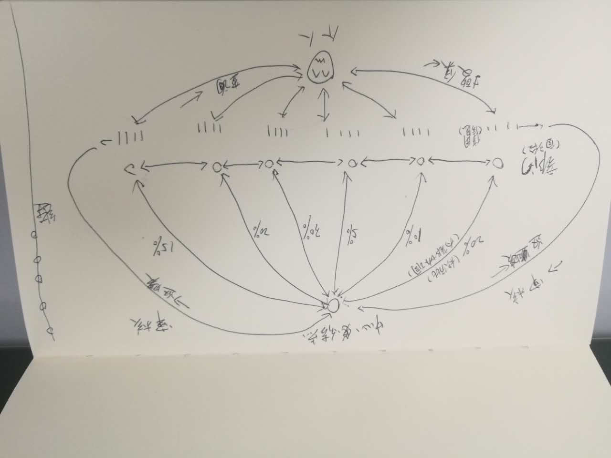

# A Demo With Django

## Basic

1. 基本角色
    1. 诚信办
        1. 各办事人员
    2. 各部门
        1. 各办事人员
    
2. 基本功能
    1. 诚信办
        1. 创建基础信息条目
        2. 审核各部门的信息条目
        3. 提供被搜集信息的主体(自然人、企业)
        4. 对各部门的评分做权重，给出总分
        
    2. 各部门
        1. 创建信息条目，并等待审核
        2. (搜集并)录入信息
        3. 评分
        4. 上报总分到诚信办

## 基本数据结构

### department:
> 部门表

| 字段    | 类型         | 含义     |
| :---:   | :---:        | :---:    |
| id      | unsigned int | id       |
| title   | varchar(255) | 部门名称 |
| weigths | unsigned int | 权重     |

### person
> 个人表 

| 字段      | 类型         | 含义       |
| :---:     | :---:        | :---:      |
| id        | unsigned int | id         |
| name      | varchar(255) | 姓名       |
| sex       | tinyint(1)   | 性别1男2女 |
| id_number | char(18)     | 身份证号   |
| address   | varchar(255) | 地址       |
| token     | char(32)     | token      |

### info
> 元信息表

| 字段          | 类型         | 含义                   |
| :---:         | :---:        | :---:                  |
| id            | unsigned int | id                     |
| type          | tinyint(1)   | 类型，1自然人，2为企业 |
| department    | unsigned int | 部门id                 |
| verify        | tinyint(1)   | 是否已经审核           |
| title         | varchar(255) | 标题                   |
| desc          | varchar(255) | 描述                   |
| remark        | varchar(255) | 额外信息               |
| score         | unsigned int | 分值                   |
| maximum_score | unsigned int | 可获取做高分值         |

### score
> 评分表

| 字段   | 类型             | 含义   |
| :---:  | :---:            | :---:  |
| id     | unsigned int     | id     |
| person | unsigned int     | 个人id |
| score  | unsigned int     | 分数   |
| year   | tinyint(4)       | 年份   |
| month  | tinyint(2)       | 月份   |
| day    | tinyint(2)       | 天数   |
| time   | unsigned int(15) | 时间戳 |

以上基本数据结构是单系统的数据结构，还有一些暂时没有想到的。

## 进一步的构想

### 简单的架构

> 解藕诚信办和各部门

1. 应用的中心节点是诚信办，应该和各部门的系统分开

2. 中心节点提供统一接口，各部门可以通过这些接口推送数据
    1. 提供获取个人或者企业元信息的接口
    2. 部门创建元信息时，推送给诚信办审核
    3. 部门推送部门相关评分信息
    4. 推送其他信息
    
3. 部门节点提供统一格式的接口，以供中心节点(诚信办)推送数据和获取数据、其他部门信息交换(比如联合惩戒)
    1. 推送元信息数据
    2. 随时获取某部门的某项信息
    3. 其他信息

以上这些信息都是元信息，元信息如何加工由具体业务操作。

## Symfony 版
[请看](https://github.com/ohmountain/cxb-prototype.git)
